# System Design Diagrams

This document is the visual map for Aria. It uses plain ASCII diagrams for quick terminal reading and Mermaid diagrams for renderable views on GitHub and other Markdown viewers.

## Mental Model

Aria is a turn-taking voice avatar. The browser owns the live human interface. The backend owns OpenAI calls and secrets. OpenAI owns model generation, speech-to-text, and text-to-speech.

```text
Human
  |
  | click, type, speak, pause
  v
Browser UI
  |
  | HTTPS to local FastAPI app
  v
Backend
  |
  | HTTPS to OpenAI, server-side key only
  v
OpenAI APIs
```

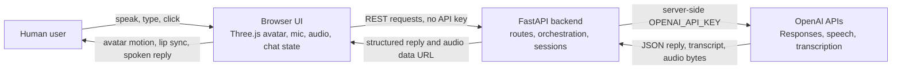

## Runtime Topology

The app is one FastAPI process serving both the API and the static frontend.

```text
Process: python -m uvicorn app.main:app --reload

127.0.0.1:8000
|
+-- GET  /                         -> frontend/index.html
+-- GET  /src/*                    -> frontend modules
+-- GET  /assets/*                 -> CSS/assets
+-- GET  /api/health               -> config health
+-- GET  /api/config               -> public runtime config
+-- POST /api/conversations        -> create local session
+-- POST /api/conversations/:id/messages
|                                      -> OpenAI Responses + TTS
+-- POST /api/speech/transcriptions
                                       -> OpenAI transcription
```

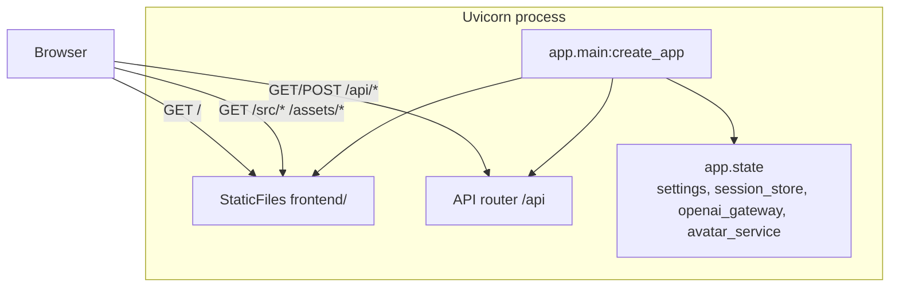

## Frontend Module Map

The browser side is split by responsibility. `frontend/src/app.js` composes everything but does not own rendering, API details, or audio internals.

```text
frontend/src/app.js
|
+-- api/client.js
|     owns fetch calls to FastAPI
|
+-- core/state.js
|     owns conversation id, selected voice, busy, live mode
|
+-- ui/dom.js + ui/chatView.js
|     owns DOM references and visible UI updates
|
+-- audio/recorder.js
|     owns microphone capture, RMS level, silence pause detection
|
+-- audio/player.js
|     owns TTS playback and analyser output for mouth movement
|
+-- avatar/avatarScene.js
      owns Three.js scene, camera, gestures, idle animation
      |
      +-- avatar/modelLoader.js
      +-- avatar/expressionController.js
```

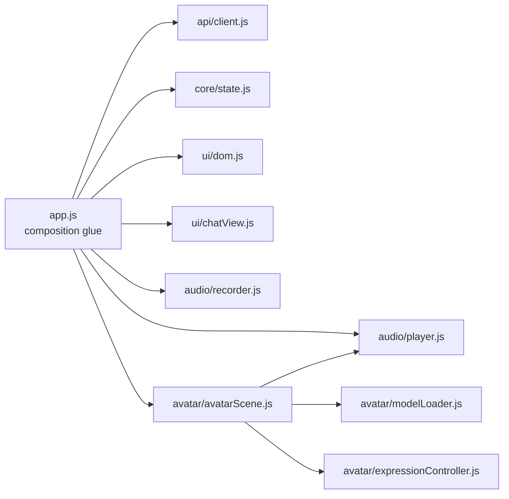

## Backend Module Map

The backend keeps HTTP, domain contracts, OpenAI transport, and orchestration separate.

```text
app/main.py
|
+-- app/api/router.py
|     |
|     +-- routes/health.py
|     +-- routes/conversations.py
|     +-- routes/speech.py
|
+-- app/api/dependencies.py
|     reads app.state dependencies
|
+-- app/domain/schemas.py
|     Pydantic request/response contracts
|
+-- app/domain/prompts.py
|     avatar and live-interview instructions
|
+-- app/services/orchestrator.py
|     one message turn = response + speech + session append
|
+-- app/services/openai_gateway.py
|     direct HTTP adapter for OpenAI endpoints
|
+-- app/services/session_store.py
      in-memory conversation state and last response id
```

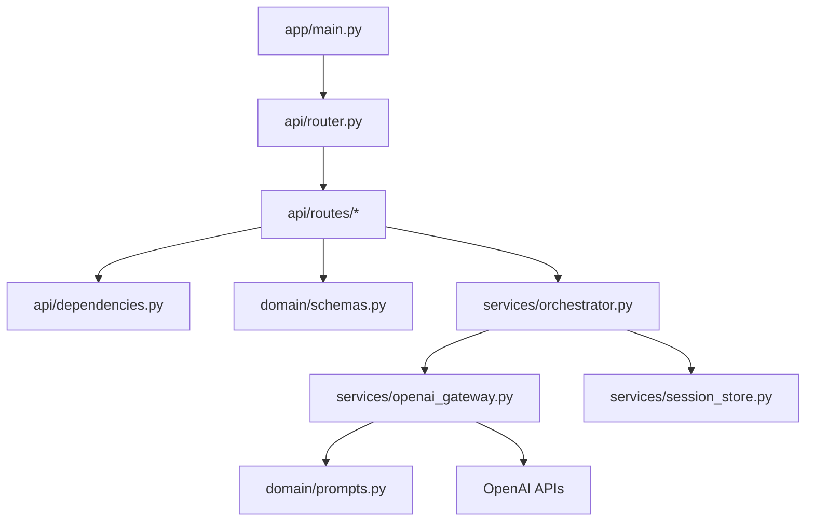

## Typed Message Turn

A typed turn is the simplest flow. It still produces speech and avatar animation.

```text
User types
  |
  v
app.js sendMessage()
  |
  | POST /api/conversations/:id/messages
  | body: { message, voice, interaction_mode: "chat" }
  v
FastAPI route
  |
  v
AvatarConversationService
  |
  +--> OpenAI Responses API -> structured reply JSON
  |
  +--> OpenAI speech API -> mp3 bytes
  |
  +--> session_store append turn
  v
Browser receives reply + audio data URL
  |
  +--> chat bubble
  +--> expression + gesture
  +--> AudioPlayer plays speech
  +--> AvatarScene lip-syncs from analyser
```

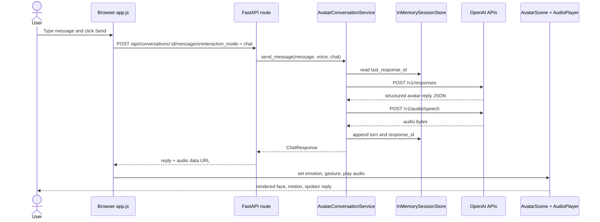

## Live Interview Turn

Live mode is pause-detected turn-taking. It is not WebRTC streaming. The browser records a turn, detects a pause, sends the audio for transcription, then sends the transcript as a live-interview message.

```text
User clicks Live
  |
  v
Browser starts mic capture
  |
  v
MicRecorder samples time-domain audio
  |
  +-- no speech yet for idleTimeoutMs
  |      -> reset recorder and keep listening
  |
  +-- speech level >= speechThreshold
         |
         v
      speechStarted = true
         |
         v
      user pauses for silenceMs
         |
         v
      stop recording with reason = silence
         |
         v
      transcribe audio
         |
         v
      send transcript with interaction_mode = live_interview
         |
         v
      Aria speaks reply
         |
         v
      audio ended
         |
         v
      if Live is still on, start listening again
```

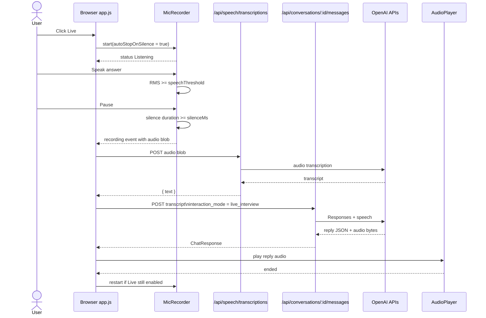

## Live Mode State Machine

The visible top-bar status follows this lifecycle.

```text
Ready
  |
  | user clicks Live
  v
Listening
  |
  | speech then pause
  v
Pause detected
  |
  | transcription request
  v
Thinking
  |
  | model + TTS response ready
  v
Speaking
  |
  | audio ended and Live still on
  v
Listening

Any state
  |
  | user clicks Live off, New, or mic cancel
  v
Ready

Any request failure
  |
  v
Live reply failed / Transcription failed / Mic error
```

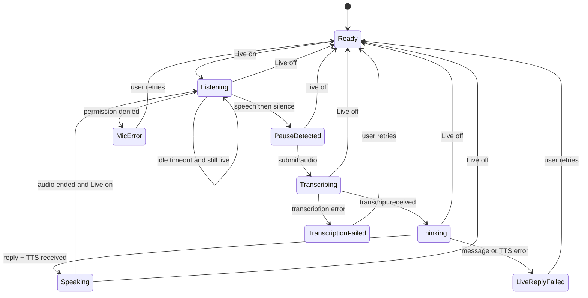

## Data Contracts

The browser must always send `interaction_mode`. This keeps typed turns and pause-detected turns explicit.

```text
POST /api/conversations/{conversation_id}/messages

Request:
{
  "message": "I finished describing my last project.",
  "voice": "alloy",
  "interaction_mode": "live_interview"
}

Response:
{
  "conversation_id": "conv_...",
  "message_id": "msg_...",
  "response_id": "resp_...",
  "reply": {
    "text": "Thanks. What was the toughest part?",
    "emotion": "neutral",
    "gesture": "nod",
    "listen_hint": ""
  },
  "audio": {
    "mime_type": "audio/mpeg",
    "format": "mp3",
    "data_url": "data:audio/mpeg;base64,..."
  },
  "usage": {}
}
```

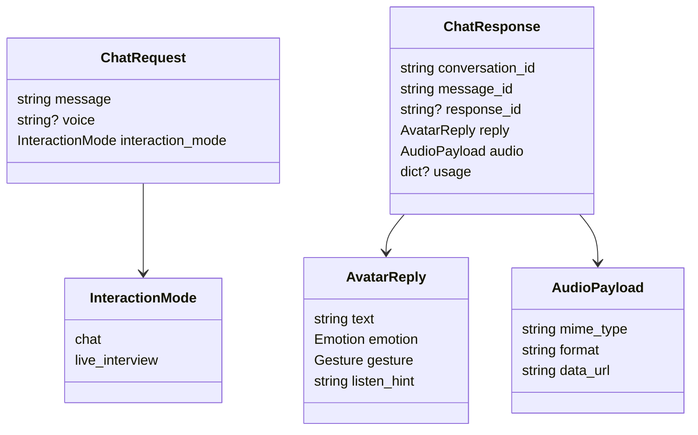

## OpenAI Boundary

The browser never sees `OPENAI_API_KEY`. The key is read by the backend process only.

```text
Browser memory
  contains:
    - conversation id
    - selected voice
    - typed text
    - recorded audio blob
    - returned audio data URL
  does not contain:
    - OPENAI_API_KEY

Backend process
  contains:
    - OPENAI_API_KEY from shell or .env
    - OpenAIGateway HTTP client
    - in-memory session store
```

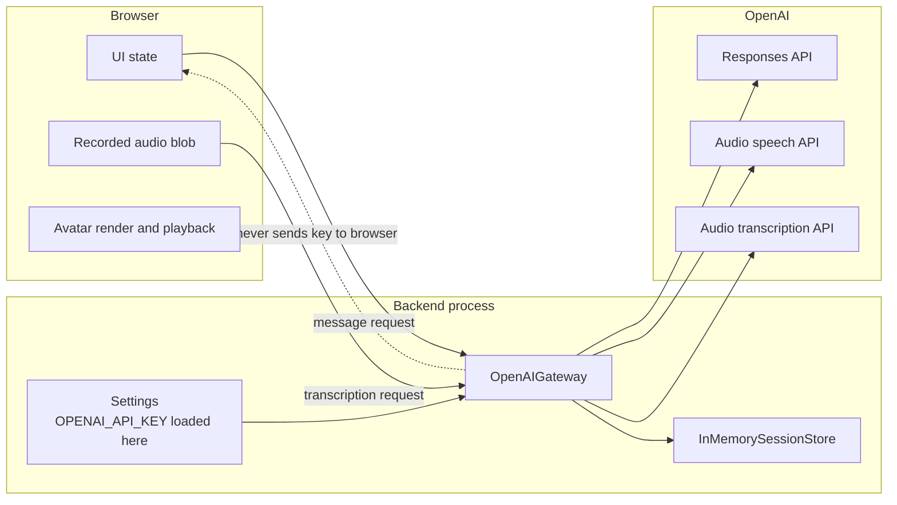

## Session Continuity

The local store is deliberately small. OpenAI continuity is carried by `previous_response_id`.

```text
ConversationState
|
+-- conversation_id
+-- created_at
+-- updated_at
+-- turns[]
+-- last_response_id  -----------------------------+
                                                     |
Next user turn                                      |
  |                                                  |
  v                                                  |
OpenAI Responses request includes previous_response_id
```

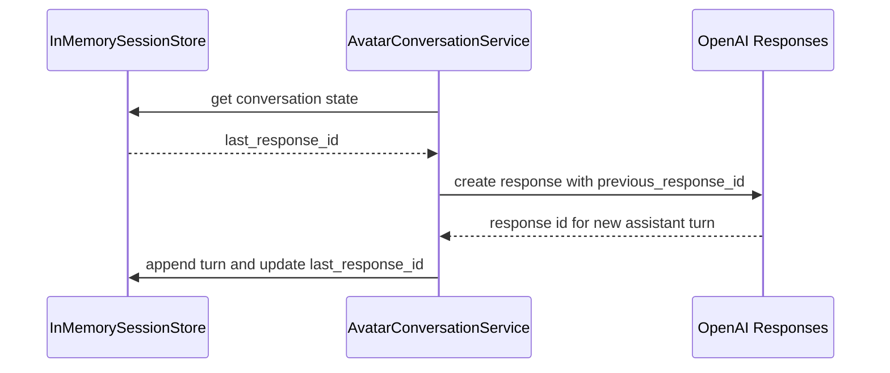

## Failure Paths

Most failures are surfaced as short visible status messages rather than hidden console-only errors.

```text
Mic permission denied
  -> status: Mic error
  -> Live mode turns off

No speech during idleTimeoutMs
  -> recorder resets
  -> status remains Listening
  -> no transcription request is sent

Blank transcription
  -> no user turn added in live mode
  -> listener restarts

OpenAI transcription failure
  -> status: Transcription failed or Live reply failed
  -> system message added

Message/TTS failure
  -> status: Reply failed or Live reply failed
  -> system message added
```

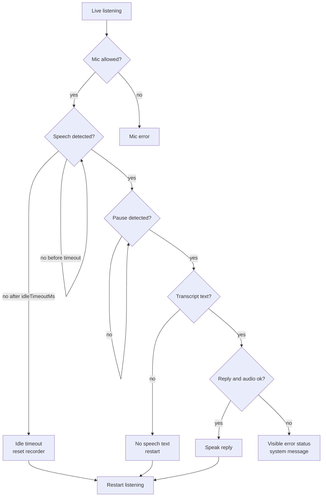

## Timing Knobs

These values live in the browser because pause detection depends on the user's microphone and environment.

| Setting | Owner | Meaning |
| --- | --- | --- |
| `speechThreshold` | `frontend/src/app.js` -> `MicRecorder` | RMS level that counts as active speech. |
| `silenceMs` | `frontend/src/app.js` -> `MicRecorder` | Silence duration after speech before the turn is submitted. |
| `minSpeechMs` | `frontend/src/app.js` -> `MicRecorder` | Minimum speech duration before silence can stop recording. |
| `idleTimeoutMs` | `frontend/src/app.js` -> `MicRecorder` | No-speech timeout that resets live listening without sending audio. |
| `max_tts_chars` | `app/core/config.py` | Backend cap before sending text to TTS. |
| `session_ttl_seconds` | `app/core/config.py` | In-memory session lifetime. |

## Production Upgrade Map

The current design is intentionally local and debuggable. These are the main upgrade points.

```text
Current
  FastAPI static serving
  in-memory sessions
  local browser permissions
  REST turn-taking

Production options
  CDN or app host for frontend
  Redis/Postgres session store
  authentication and per-user conversation ownership
  CSRF/rate limits if cookies are used
  WebRTC/OpenAI realtime session if true streaming is required
```

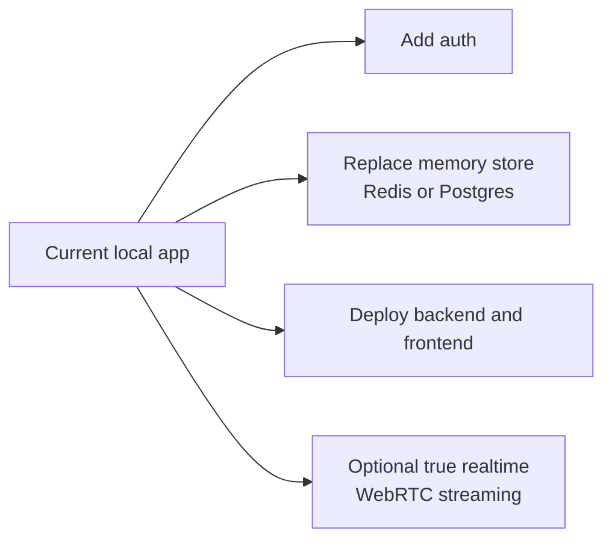

